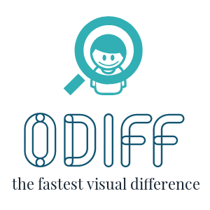
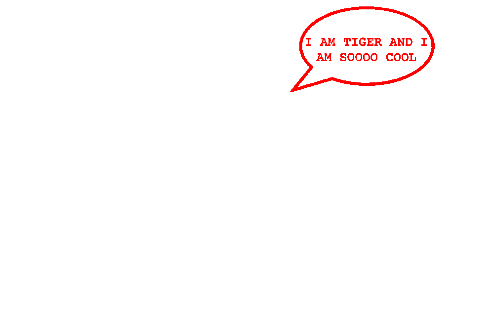
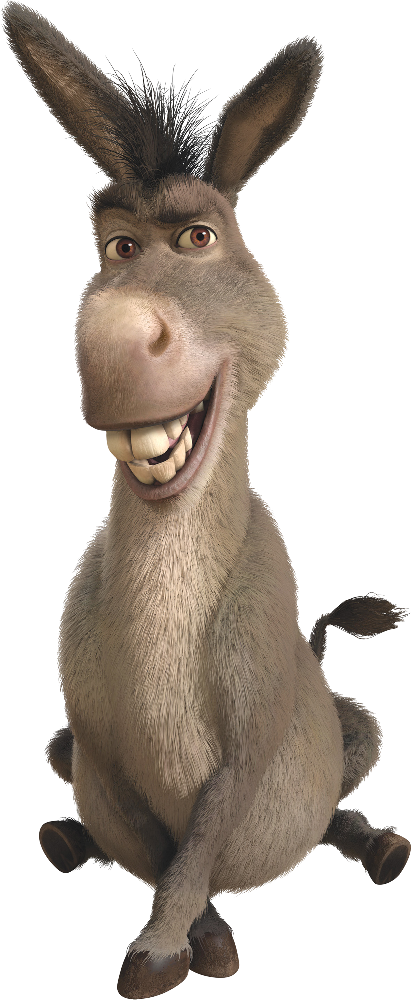
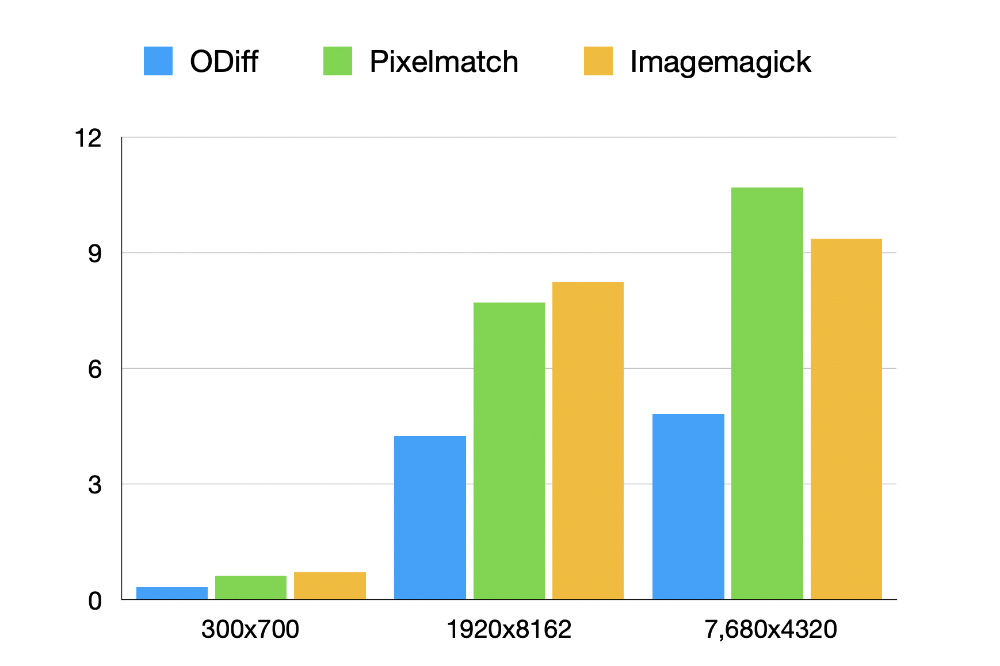

<p align="center">
  
</p>

<h1 align="center"> ODIFF </h1>
<h3 align="center"> The fastest* (one-thread) pixel-by-pixel image difference tool in the world. </h3>

<div align="center">
    
    
    
</div>


## Why Odiff?

ODiff is a blazing fast native image comparison tool. Check [benchmarks](#benchmarks) for the results, but it compares the visual difference between 2 images in **milliseconds**. It was originally designed to handle the "big" images. Thanks to [OCaml](https://ocaml.org/) and its speedy and predictable compiler we can significantly speed up your CI pipeline.

[](https://vshymanskyy.github.io/StandWithUkraine/)

## Demo

| base                           | comparison                       | diff                                  |
| ------------------------------ | -------------------------------- | ------------------------------------- |
|           |           |        |
|  |  |  |
|          |          |       |

## Features

- ✅ Cross-format comparison - Yes .jpg vs .png comparison without any problems.
- ✅ Support for `.png`, `.jpeg`, `.jpg`, and `.tiff`
- ✅ Supports comparison of images with different layouts.
- ✅ Anti-aliasing detection
- ✅ Ignoring regions
- ✅ Using [YIQ NTSC
  transmission algorithm](http://www.progmat.uaem.mx:8080/artVol2Num2/Articulo3Vol2Num2.pdf) to determine visual difference.

### Coming in the nearest future:

- ⏹ Reading image from memory buffer
- ⏹ Reading images from url 

## Usage

### Basic comparison

Run the simple comparison. Image paths can be one of supported formats, diff output can only be `.png`.

```
odiff <IMG1 path> <IMG2 path> <DIFF output path>
```

### Node.js

We also provides direct node.js binding for the `odiff`. Run the `odiff` from nodejs:

```js
const { compare } = require("odiff-bin");

const { match, reason } = await compare(
  "path/to/first/image.png",
  "path/to/second/image.png",
  "path/to/diff.png"
);
```

### Cypress
Checkout [cypress-odiff](https://github.com/odai-alali/cypress-odiff), a cypress plugin to add visual regression tests using `odiff-bin`.

### Visual regression services

[LostPixel](https://github.com/lost-pixel/lost-pixel) – Holistic visual testing for your Frontend allows very easy integration with storybook and uses odiff for comparison

[Argos CI](https://argos-ci.com/) – Visual regression service powering projects like material-ui. ([It became 8x faster with odiff](https://twitter.com/argos_ci/status/1601873725019807744))

[Visual Regression Tracker](https://github.com/Visual-Regression-Tracker/Visual-Regression-Tracker) – Self hosted visual regression service that allows to use odiff as screenshot comparison engine 

[OSnap](https://github.com/eWert-Online/OSnap) – Snapshot testing tool written in OCaml that uses config based declaration to define test and was built by odiff collaborator. 

## Api

Here is an api reference:

### CLI

The best way to get up-to-date cli interface is just to type the

```
odiff --help
```

### Node.js

NodeJS Api is pretty tiny as well. Here is a typescript interface we have:

<!--inline-interface-start-->
```tsx
export type ODiffOptions = Partial<{
  /** Color used to highlight different pixels in the output (in hex format e.g. #cd2cc9). */
  diffColor: string;
  /** Output full diff image. */
  outputDiffMask: boolean;
  /** Do not compare images and produce output if images layout is different. */
  failOnLayoutDiff: boolean;
  /** Return { match: false, reason: '...' } instead of throwing error if file is missing. */
  noFailOnFsErrors: boolean;
  /** Color difference threshold (from 0 to 1). Less more precise. */
  threshold: number;
  /** If this is true, antialiased pixels are not counted to the diff of an image */
  antialiasing: boolean;
  /** If `true` reason: "pixel-diff" output will contain the set of line indexes containing different pixels */
  captureDiffLines: boolean;
  /** An array of regions to ignore in the diff. */
  ignoreRegions: Array<{
    x1: number;
    y1: number;
    x2: number;
    y2: number;
  }>;
}>;

declare function compare(
  basePath: string,
  comparePath: string,
  diffPath: string,
  options?: ODiffOptions
): Promise<
  | { match: true }
  | { match: false; reason: "layout-diff" }
  | {
      match: false;
      reason: "pixel-diff";
      /** Amount of different pixels */
      diffCount: number;
      /** Percentage of different pixels in the whole image */
      diffPercentage: number;
      /** Individual line indexes containing different pixels. Guaranteed to be ordered and distinct.  */
      diffLines?: number[];
    }
  | {
      match: false;
      reason: "file-not-exists";
      /** Errored file path */
      file: string;
    }
>;

export { compare };
```
<!--inline-interface-end-->"
 
Compare option will return `{ match: true }` if images are identical. Otherwise return `{ match: false, reason: "*" }` with a reason why images were different.

> Make sure that diff output file will be created only if images have pixel difference we can see 👀

## Installation

We provide prebuilt binaries for most of the used platforms, there are a few ways to install them: 

### Cross-platform

The recommended and cross-platform way to install this lib is npm and node.js. Make sure that this package is compiled directly to the platform binary executable, so the npm package contains all binaries and `post-install` script will automatically link the right one for the current platform.

> **Important**: package name is **odiff-bin**. But the binary itself is **odiff**

```
npm install odiff-bin
```

Then give it a try 👀

```
odiff --help
```

### From binaries

Download the binaries for your platform from [release](https://github.com/dmtrKovalenko/odiff/releases) page.

## Benchmarks

> Run the benchmarks by yourself. Instructions of how to run the benchmark is [here](./images)



Performance matters. At least for sort of tasks like visual regression. For example, if you are running 25000 image snapshots per month you can save **20 hours** of CI time per month by speeding up comparison time in just **3 seconds** per snapshot.

```
3s * 25000 / 3600 = 20,83333 hours
```

Here is `odiff` performance comparison with other popular visual difference solutions. We are going to compare some real-world use cases.

Lets compare 2 screenshots of full-size [https::/cypress.io](cypress.io) page:

| Command                                                                                    |      Mean [s] | Min [s] | Max [s] |    Relative |
| :----------------------------------------------------------------------------------------- | ------------: | ------: | ------: | ----------: |
| `pixelmatch www.cypress.io-1.png www.cypress.io.png www.cypress-diff.png`                  | 7.712 ± 0.069 |   7.664 |   7.896 | 6.67 ± 0.03 |
| ImageMagick `compare www.cypress.io-1.png www.cypress.io.png -compose src diff-magick.png` | 8.881 ± 0.121 |   8.692 |   9.066 | 7.65 ± 0.04 |
| `odiff www.cypress.io-1.png www.cypress.io.png www.cypress-diff.png`                       | 1.168 ± 0.008 |   1.157 |   1.185 |        1.00 |

Wow. Odiff is mostly 6 times faster than imagemagick and pixelmatch. And this will be even clearer if image will become larger. Lets compare an [8k image](images/water-4k.png) to find a difference with [another 8k image](images/water-4k-2.png):

| Command                                                                       |       Mean [s] | Min [s] | Max [s] |    Relative |
| :---------------------------------------------------------------------------- | -------------: | ------: | ------: | ----------: |
| `pixelmatch water-4k.png water-4k-2.png water-diff.png`                       | 10.614 ± 0.162 |  10.398 |  10.910 | 5.50 ± 0.05 |
| Imagemagick `compare water-4k.png water-4k-2.png -compose src water-diff.png` |  9.326 ± 0.436 |   8.819 |  10.394 | 5.24 ± 0.10 |
| `odiff water-4k.png water-4k-2.png water-diff.png`                            |  1.951 ± 0.014 |   1.936 |   1.981 |        1.00 |

Yes it is significant improvement. And the produced difference will be the same for all 3 commands.

## Changelog

If you have recently updated, please read the [changelog](https://github.com/dmtrKovalenko/odiff/releases) for details of what has changed.

## License

The project is licensed under the terms of [MIT license](./LICENSE)

## Thanks

This project was highly inspired by [pixelmatch](https://github.com/mapbox/pixelmatch) and [imagemagick](https://github.com/ImageMagick/ImageMagick).

## Support the project

...one day a donation button will appear here. But for now you can follow [author's twitter](https://twitter.com/dmtrKovalenko) :)
